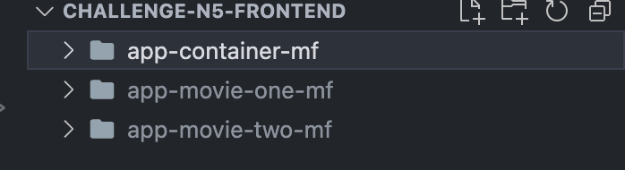
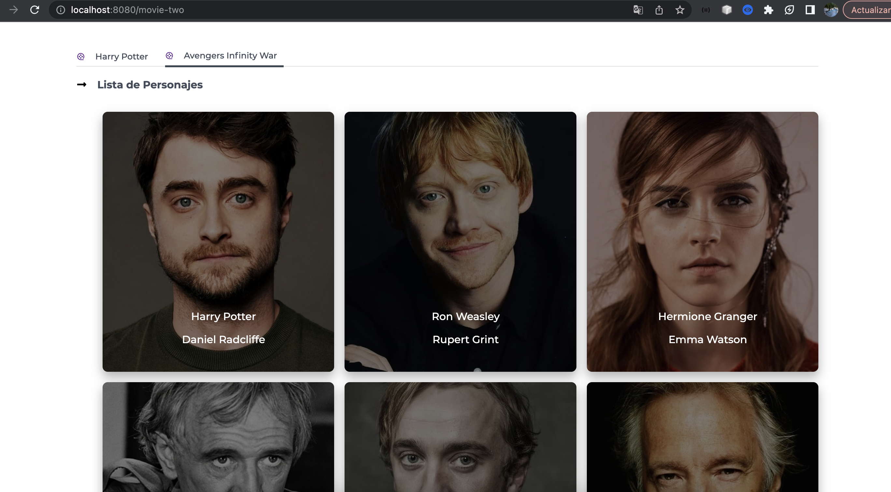

# Movies personages

Prueba tecnica N5 - Microfronts

- Consiste en una web, en la cual, hay 2 segmentos(peliculas) y cada 1 redirecciona a una lista de personajes.

## Requisitos

- Node.js (versión v14.17.3)
- npm (viene con Node.js)
- Tener libre el puerto 8080(container), 8081(app-movie-one-mf) y 8082 (app-movie-two-mf)

## Tecnologias

- WebPack
- ModuleFederationPlugin
- React
- Typescript
- StyledComponent
- Jest

## Adicional

- Unit test
- Patrones de diseño (singleton, repository, injección de dependencias)
- MicroFrontend

## Instalación

1. Instala las dependencias: `npm install` de preferencia la version del node indicado lineas arriba.

## Descripción

- Se ha utilizado 3 proyectos, El app-container-mf (shell), y 2 microfronts : app-movie-one-mf, app-movie-two-mf.

## Uso

1. app-movie-one-mf => Ejecuta el proyecto : `npm run start` -- anteponer sudo en caso sea necesario.
1. app-movie-two-mf => Ejecuta el proyecto : `npm run start` -- anteponer sudo en caso sea necesario.
1. app-container-mf => Ejecuta el proyecto : `npm run start` -- anteponer sudo en caso sea necesario.

## Unit Test

1. Para correr las unit test en la consola: `npm run test`
